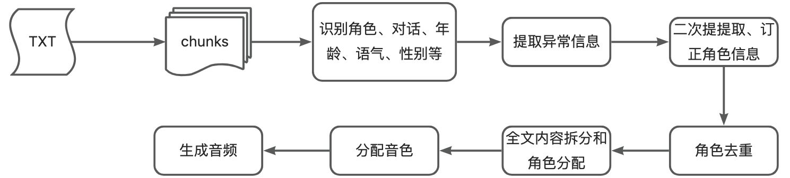

### 核心功能
1. 智能解析小说文本 - 从小说中提取人物对话内容

2. 角色识别 - 识别说话角色、性别、年龄、语气等特征

3. 音色匹配 - 为不同角色匹配合适的语音音色

4. 音频生成 - 将处理后的文本转换为语音

### 处理流程

### 使用服务
qwen3-max : 用于提取角色，分配音色等任务

qwen3-tts-flash-2025-11-27 ： 用于生成音频

